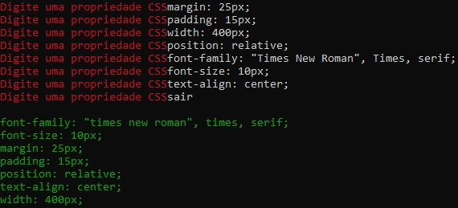
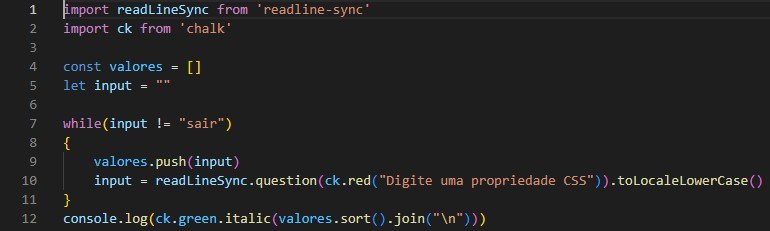

# Projeto-individual

## PROJETO INDIVIDUAL Módulo 5 – Facilitando o dia a dia

Esse projeto teve como finalidade o uso do Node para montar um código que vai receber uma lista de propriedades de CSS (ex: background-color, font-size, text-align) e vai devolver essa lista ordenada de A-Z. Ordenar o CSS ajuda a encontrar mais rápido a propriedade que precisamos alterar.

### Prompt do Node 


Para realização do trabalho criei uma pasta no qual foi iniciado o npm para a instalação das bibliotecas "chalk" e "readlineSync". Logo após criei o arquivo index.js para colocar o código e integrar as bibliotecas npm instaladas.

### Código utilizado


### Como usar

1. Instale o [Node.js](https://nodejs.org/en/) em seu computador.
2. Clone ou faça o download deste repositório.
3. Abra o terminal ou o prompt de comando na pasta do repositório.
4. Execute o seguinte comando para iniciar o script:

```
node index.js
```

5. Insira as propriedades CSS desejadas, uma por linha. Para finalizar a inserção de propriedades, digite "SAIR".
6. O script exibirá a lista das propriedades CSS inseridas, ordenadas alfabeticamente em ordem crescente.

## :hammer_and_wrench: Ferramentas utilizadas
* Visual Studio Code
* Node.js
* JavaScript

chalk :https://www.npmjs.com/package/chalk

readlineSync: https://www.npmjs.com/package/readline-sync
